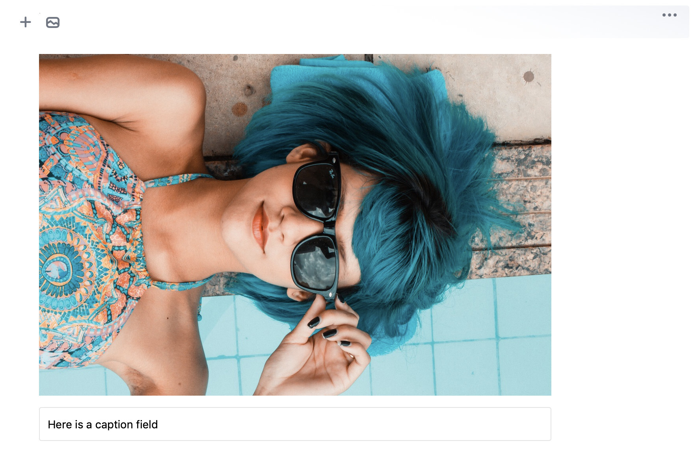

# Simple Image tutorial project
Final result of guide series learning [how to create own Block Tool](https://editorjs.io/creating-a-block-tool) for Editor.js

Simple Image — paste image URL and get the image Block rendered.
Also supports pasting files and substitutions of `` tags on pasting.
Does not support uploading images from the device.



## Chapters

- [The first plugin](https://editorjs.io/the-first-plugin)
- [Fill Block with saved data](https://editorjs.io/fill-block-with-saved-data)
- [Saved data validation](https://editorjs.io/saved-data-validation)
- [Changing a view](https://editorjs.io/changing-a-view)
- [Enable Inline Toolbar](https://editorjs.io/enable-inline-toolbar)
- [Making a Block Settings](https://editorjs.io/making-a-block-settings)
- [Access Editor's API](https://editorjs.io/access-api)
- [Paste substitutions](https://editorjs.io/paste-substitutions)
- [Sanitize saved data](https://editorjs.io/sanitize-saved-data)
- [Provide custom configuration](https://editorjs.io/provide-custom-configuration)


## Installation

**Note.** If you want to use such tool in production, see full-featured [Simple Image](https://github.com/editor-js/simple-image) Tool.
The tutorial code and functionality are simplified for better understanding of basics API usage.

## Configuration

This Tool supports following configuration properties:

| name | description |
| -- | -- |
| `placeholder` | Custom placeholder for «Paste URL» field |

Example of connection:

```js
  /**
   * Initialize the Editor
   */
  const editor = new EditorJS({
    autofocus: true,
    tools: {
      image: {
        class: SimpleImage,
        inlineToolbar: true,
        config: {
          placeholder: 'Paste image URL'
        }
      }
    },
  });
```

## Output data format

This Tool return following data format:

```js
{
  url: 'https://cdn.pixabay.com/photo/2017/09/01/21/53/blue-2705642_1280.jpg'
  caption: 'Image caption example',
  withBorder: false,
  withBackground: false,
  stretched: false
}
```

| field | type | description |
| -- | -- | -- |
| `url` | __string__ | image source URL |
| `caption` | __string__ | image caption |
| `withBorder` | __boolean__ | flag for adding a border |
| `withBackground` | __boolean__ | flag for adding a background |
| `stretched` | __boolean__ | flag for stretching image to the full width of content |